# 🚀 SummarEaseAI v2.0

**SummarEaseAI v2.0** is an AI-powered chatbot that intelligently summarizes Wikipedia articles using state-of-the-art machine learning technologies. It combines **TensorFlow neural networks** for intent classification, **🤗 Hugging Face Transformers** for local AI capabilities, **LangChain** for prompt orchestration, and **OpenAI's GPT** models for high-quality summarization—all wrapped in a beautiful Streamlit interface.

<div align="center">


</div>

---

## 🎯 Currently Working Features ✅

### 🧠 **Intent Recognition**
- **TensorFlow Neural Network**: ✅ **WORKING** - Custom Bidirectional LSTM model for intent classification
- **Keyword-based Fallback**: ✅ **WORKING** - Reliable backup intent classification system
- **9 Intent Categories**: ✅ **WORKING** - History, Science, Biography, Technology, Arts (includes Music), Sports, Politics, Geography, General
- **Real-time Confidence Scoring**: ✅ **WORKING** - Interactive gauges showing prediction confidence

### 🤖 **Multi-Source Intelligence**
- **🤖 Multi-Source Agent**: ✅ **WORKING** - Advanced multi-article synthesis with LangChain agents
- **QueryEnhancementAgent**: ✅ **WORKING** - Intelligent query refinement and expansion
- **ArticleSelectionAgent**: ✅ **WORKING** - Smart Wikipedia article selection from search results
- **Wikipedia Content Sanitization**: ✅ **WORKING** - Handles curly braces and wiki markup safely
- **Cost Control**: ✅ **WORKING** - BALANCED/MINIMAL/COMPREHENSIVE modes for API usage
- **Comprehensive Synthesis**: ✅ **WORKING** - Combines multiple Wikipedia articles into coherent summaries

### ✂️ **Summarization Engines**
- **OpenAI + LangChain**: ✅ **WORKING** - High-quality cloud-based summarization
- **Multi-Source Synthesis**: ✅ **WORKING** - Combines multiple articles with intelligent agents
- **Length Control**: ✅ **WORKING** - Customizable summary length (10-100 lines)
- **Intent-Aware Processing**: ✅ **WORKING** - Context-based summarization adaptation

### 📚 **Wikipedia Integration**
- **Smart Search**: ✅ **WORKING** - Automatic fallback to search when direct articles aren't found
- **Disambiguation Handling**: ✅ **WORKING** - Intelligent resolution of ambiguous Wikipedia pages
- **Content Sanitization**: ✅ **WORKING** - Handles Wikipedia markup and special characters
- **Multi-Article Support**: ✅ **WORKING** - Fetch and process multiple related articles

### 🎨 **Modern UI/UX**
- **5-Tab Interface**: ✅ **WORKING** - Summarize, Intent Analysis, Semantic Search, Model Comparison, Analytics
- **Real-time Visualizations**: ✅ **WORKING** - Interactive charts and gauges using Plotly
- **Model Status Indicators**: ✅ **WORKING** - Visual indicators for API and model availability
- **Progressive Enhancement**: ✅ **WORKING** - Graceful degradation when services are unavailable
- **Responsive Design**: ✅ **WORKING** - Beautiful interface with custom CSS styling

---

## 🚧 Features Under Development / Testing 🧪

### 🤗 **Local AI with Hugging Face** - NOW UNDER TEST
- **Local Summarization**: 🧪 **UNDER TEST** - Run AI models offline without API dependencies
- **Multiple Models**: 🧪 **UNDER TEST** - BART, T5, DistilBART, Pegasus for different use cases
- **GPU Acceleration**: 🧪 **UNDER TEST** - Automatic CUDA detection for faster inference

### 🔍 **Semantic Search** - NOW UNDER TEST
- **Meaning-Based Search**: 🧪 **UNDER TEST** - Find articles by semantic similarity, not just keywords
- **Sentence Transformers**: 🧪 **UNDER TEST** - Convert text to 384-dimensional meaning vectors
- **Cosine Similarity**: 🧪 **UNDER TEST** - Mathematical comparison of text meanings

### 🧠 **BERT Intent Classification** - NOW UNDER TEST
- **🤗 BERT Transformer**: 🧪 **UNDER TEST** - Pre-trained BERT model fine-tuned for intent detection
- **Model Comparison**: 🧪 **UNDER TEST** - Side-by-side comparison of TensorFlow vs BERT performance

---

## 🛠️ Technology Stack

| Component | Technology | Status | Purpose |
|-----------|------------|--------|---------|
| **Frontend** | Streamlit | ✅ **WORKING** | Interactive web interface |
| **Backend** | Flask + CORS | ✅ **WORKING** | RESTful API server |
| **Intent Classification** | TensorFlow + Keywords | ✅ **WORKING** | Dual ML approach |
| **Multi-Source Agents** | LangChain + OpenAI | ✅ **WORKING** | Intelligent article synthesis |
| **Summarization** | LangChain + OpenAI | ✅ **WORKING** | Cloud-based summarization |
| **Local AI** | 🤗 Transformers | 🧪 **UNDER TEST** | Local model inference |
| **Semantic Search** | 🤗 Sentence Transformers | 🧪 **UNDER TEST** | Meaning-based retrieval |
| **Data Source** | Wikipedia API | ✅ **WORKING** | Article content |
| **Visualization** | Plotly | ✅ **WORKING** | Interactive charts |

---

## 🚀 Quick Start

### Prerequisites
- Python 3.8+
- OpenAI API key (required for current working features)
- 4GB+ RAM (recommended)
- Git

### 1. Clone the Repository
```bash
git clone https://github.com/your-username/SummarEaseAI.git
cd SummarEaseAI
```

### 2. Install Dependencies
```bash
pip install -r requirements.txt
```

### 3. Environment Setup
```bash
cp env.template .env
# Edit .env and add your OpenAI API key
```

### 4. Train TensorFlow Model
```bash
cd tensorflow_models
python train_model.py
cd ..
```

### 5. Start the Application
```bash
# Terminal 1 - Backend API
cd backend && python api_simple.py

# Terminal 2 - Frontend (in new terminal)
streamlit run app.py
```

### 6. Quick Start Script
```bash
# Alternative: Use the quick start script
python quick_start.py
```

### 7. Access the Application
Open your browser and navigate to `http://localhost:8501`

---

## 📊 Current Architecture

```mermaid
graph TD
    A[User Input] --> B[Streamlit Frontend v2.0]
    B --> C[Flask API Backend]
    C --> D[Intent Classifier]
    D --> E[TensorFlow LSTM ✅]
    D --> F[Keyword Fallback ✅]
    C --> G[Multi-Source Agent ✅]
    G --> H[QueryEnhancementAgent ✅]
    G --> I[ArticleSelectionAgent ✅]
    C --> J[OpenAI + LangChain ✅]
    C --> K[Wikipedia Fetcher ✅]
    K --> L[Wikipedia API ✅]
    J --> M[Cloud Summary ✅]
    H --> N[Enhanced Queries ✅]
    I --> O[Selected Articles ✅]
    M --> B
    N --> K
    O --> J
    
    %% Under Test Features
    C --> P[🧪 Local HF Models]
    C --> Q[🧪 Semantic Search]
    C --> R[🧪 BERT Intent]
    P --> S[🧪 Local Summary]
    Q --> T[🧪 Vector Search]
    R --> U[🧪 BERT Prediction]
```



---

## 🔧 Detailed Usage

### Working API Endpoints ✅

#### Core Endpoints
- `GET /` - API status and feature availability ✅
- `GET /health` - Health check ✅
- `GET /status` - Detailed system status ✅

#### Intent Classification
- `POST /predict_intent` - TensorFlow LSTM + keyword fallback ✅

#### Summarization
- `POST /summarize` - OpenAI + LangChain summarization ✅
- `POST /summarize_multi_source` - Multi-source agent synthesis ✅
- `POST /summarize_agentic` - Enhanced agentic summarization ✅

#### Wikipedia Integration
- `POST /search_wikipedia` - Smart Wikipedia search ✅

### Under Test Endpoints 🧪

#### Advanced Features
- `POST /predict_intent_bert` - 🧪 BERT intent prediction
- `POST /compare_models` - 🧪 Compare TensorFlow vs BERT
- `POST /summarize_local` - 🧪 Local Hugging Face summarization
- `POST /semantic_search` - 🧪 Semantic Wikipedia search

### Usage Examples

#### 1. Multi-Source Agent (Working ✅)
```python
import requests

response = requests.post('http://localhost:5000/summarize_multi_source', json={
    'query': 'Who were the Beatles?',
    'max_lines': 30,
    'use_intent': True
})

result = response.json()
print(f"Summary: {result['summary']}")
print(f"Articles used: {result['wikipedia_pages_used']}")
print(f"Agent powered: {result['agent_powered']}")
```

#### 2. Intent Classification (Working ✅)
```python
response = requests.post('http://localhost:5000/predict_intent', json={
    'text': 'Tell me about quantum physics'
})

result = response.json()
print(f"Intent: {result['predicted_intent']}")
print(f"Confidence: {result['confidence']}")
print(f"Model: {result['model_used']}")
```

#### 3. OpenAI Summarization (Working ✅)
```python
response = requests.post('http://localhost:5000/summarize', json={
    'query': 'Apollo 11 moon landing',
    'max_lines': 25
})

result = response.json()
print(f"Summary: {result['summary']}")
print(f"Method: {result['method']}")
```

---

## 🧪 Test Queries for Working Features

### Multi-Source Agent Examples ✅
- **"Who were the Beatles?"** → Synthesizes band info, discography, and musical style
- **"What is quantum mechanics?"** → Combines physics articles and applications
- **"Tell me about World War II"** → Merges historical events, battles, and outcomes

### Intent Classification Test Queries ✅
- **History**: "What happened during the Apollo 11 mission?"
- **Science**: "Explain how photosynthesis works"
- **Biography**: "Tell me about Marie Curie's discoveries"
- **Technology**: "How do neural networks function?"
- **Arts (Music)**: "Who were the Beatles?" 
- **Geography**: "Where are the Himalayas located?"

### Regular Summarization Examples ✅
- **"Artificial Intelligence"** → Comprehensive AI overview
- **"Climate Change"** → Environmental science summary
- **"Renaissance Art"** → Cultural and artistic movements

---

## 📈 Current Performance Metrics

### TensorFlow LSTM Intent Classifier ✅
- **Training Accuracy**: ~95%
- **Validation Accuracy**: ~92%
- **Model Size**: ~2.5MB
- **Inference Time**: <100ms per query
- **Categories**: 9 distinct intent classes (History, Science, Biography, Technology, Arts, Sports, Politics, Geography, General)
- **Fallback**: Keyword-based system for reliability

### Multi-Source Agent System ✅
- **Articles per Query**: 1-3 (configurable)
- **Cost Modes**: MINIMAL, BALANCED, COMPREHENSIVE
- **Agent Types**: QueryEnhancement, ArticleSelection
- **Response Time**: 3-8 seconds (depending on complexity)
- **Success Rate**: >95% for common topics

### OpenAI Integration ✅
- **Models Supported**: GPT-3.5-turbo, GPT-4
- **Average Response Time**: 2-5 seconds
- **Quality Score**: High (human-readable summaries)
- **Cost Control**: Configurable limits and modes

---

## 🔧 Advanced Configuration

### Environment Variables
```bash
# Required for working features
OPENAI_API_KEY=your_openai_api_key_here

# Cost control for multi-source agent
COST_MODE=BALANCED  # MINIMAL, BALANCED, COMPREHENSIVE
MAX_ARTICLES=3      # Maximum articles per query

# API configuration
API_PORT=5000
DEBUG_MODE=false
```

### Multi-Source Agent Configuration
```python
# In utils/multi_source_agent.py
COST_MODES = {
    'MINIMAL': {
        'max_articles': 1,
        'max_secondary_queries': 1,
        'enable_agents': True,
        'enable_openai': True
    },
    'BALANCED': {
        'max_articles': 3,
        'max_secondary_queries': 3,
        'enable_agents': True,
        'enable_openai': True
    },
    'COMPREHENSIVE': {
        'max_articles': 5,
        'max_secondary_queries': 5,
        'enable_agents': True,
        'enable_openai': True
    }
}
```

---

## 🚧 Future Development Roadmap

### Phase 1: Stabilize Under-Test Features 🧪
- [ ] **Complete BERT Intent Testing** - Finalize BERT model integration
- [ ] **Validate Semantic Search** - Test embedding-based article discovery
- [ ] **Local HF Model Support** - Enable offline BART/T5 summarization
- [ ] **Performance Optimization** - Improve response times and reliability

### Phase 2: Advanced Features
- [ ] **Multi-language Support** - Summarization in multiple languages
- [ ] **Document Upload** - Support for PDF, Word docs, and text files
- [ ] **Conversational Memory** - Multi-turn conversations with context
- [ ] **Custom Training** - Domain-specific model fine-tuning

### Phase 3: Enterprise Features
- [ ] **Real-time Collaboration** - Multiple users, shared workspaces
- [ ] **Advanced Analytics** - Usage patterns, model performance tracking
- [ ] **Plugin System** - Custom integrations and extensions
- [ ] **Mobile App** - React Native companion application

---

## 🤝 Contributing

We welcome contributions! Focus areas:

### High Priority (Working Features) ✅
1. **🔧 Bug Fixes** - Improve stability of working features
2. **📊 Analytics** - Enhance monitoring and metrics
3. **🎨 UI/UX** - Streamlit interface improvements
4. **📚 Documentation** - Usage guides and examples

### Medium Priority (Under Test) 🧪
1. **🤗 HuggingFace Integration** - Complete local model support
2. **🔍 Semantic Search** - Finalize embedding-based search
3. **🧠 BERT Testing** - Validate BERT intent classification
4. **🧪 Testing** - Expand test coverage for new features

### Development Setup
```bash
# Clone and setup
git clone https://github.com/your-username/SummarEaseAI.git
cd SummarEaseAI
pip install -r requirements.txt

# Test working features
python test_multi_source_fix.py
python quick_start.py
```

---

## 📝 License

This project is licensed under the MIT License - see the [LICENSE](LICENSE) file for details.

---

## 🙏 Acknowledgments

- **🤗 Hugging Face** for democratizing AI with open-source transformers
- **OpenAI** for GPT models and the OpenAI API
- **TensorFlow** team for the comprehensive ML framework
- **Streamlit** for the amazing web app framework
- **Wikipedia** for providing free access to human knowledge
- **LangChain** for powerful NLP orchestration tools

---

<div align="center">

**Built with ❤️ using AI to make information more accessible**

### 🚀 **SummarEaseAI v2.0 - Multi-Source Intelligence Now Working!**

✅ **Multi-Source Agent** | ✅ **Intent Classification** | ✅ **OpenAI Integration** | 🧪 **Local AI Under Test**

⭐ **Star this repository if you found it helpful!**

</div>
