# 🚀 SummarEaseAI v2.0

**SummarEaseAI v2.0** is an AI-powered chatbot that intelligently summarizes Wikipedia articles using state-of-the-art machine learning technologies. It combines **TensorFlow neural networks** for intent classification, **🤗 Hugging Face Transformers** for local AI capabilities, **LangChain** for prompt orchestration, and **OpenAI's GPT** models for high-quality summarization—all wrapped in a beautiful Streamlit interface.

<div align="center">


</div>

---

## 🎯 Key Features

### 🧠 **Dual Intent Recognition**
- **TensorFlow Neural Network**: Custom Bidirectional LSTM model for intent classification
- **🤗 BERT Transformer**: Pre-trained BERT model fine-tuned for intent detection
- **9 Intent Categories**: History, Science, Biography, Technology, Arts, Sports, Politics, Geography, General
- **Model Comparison**: Side-by-side comparison of TensorFlow vs BERT performance
- **Real-time Confidence Scoring**: Interactive gauges showing prediction confidence

### 🤗 **Local AI with Hugging Face**
- **Local Summarization**: Run AI models offline without API dependencies
- **Multiple Models**: BART, T5, DistilBART, Pegasus for different use cases
- **GPU Acceleration**: Automatic CUDA detection for faster inference
- **Cost-Free**: No API costs for local model inference
- **Privacy-First**: All processing happens on your machine

### 🔍 **Semantic Search with Sentence Embeddings**
- **Meaning-Based Search**: Find articles by semantic similarity, not just keywords
- **Sentence Transformers**: Convert text to 384-dimensional meaning vectors
- **Cosine Similarity**: Mathematical comparison of text meanings
- **Smart Article Discovery**: "Apollo moon landing" finds related NASA missions automatically
- **Multiple Embedding Models**: MiniLM, MPNet, and specialized Q&A models

### 📚 **Enhanced Wikipedia Integration**
- **Smart Search**: Automatic fallback to search when direct articles aren't found
- **Disambiguation Handling**: Intelligent resolution of ambiguous Wikipedia pages
- **Category Extraction**: Automatic categorization of Wikipedia content
- **Semantic Article Matching**: Use embeddings to find topically related articles

### ✂️ **Advanced Multi-Model Summarization**
- **Dual Summarization Engines**: 
  - **Cloud**: OpenAI GPT models via LangChain (high quality)
  - **Local**: Hugging Face transformers (privacy-focused, offline)
- **Length Control**: Customizable summary length (10-100 lines)
- **Context-Aware**: Intent-based summarization for better relevance
- **Model Selection**: Choose between BART, T5, or Pegasus for different summary styles
- **Compression Analytics**: Real-time metrics on text compression ratios

### 🎨 **Modern UI/UX with AI Insights**
- **5-Tab Interface**: Summarize, Intent Analysis, Semantic Search, Model Comparison, Analytics
- **Real-time Visualizations**: Interactive charts and gauges using Plotly
- **Model Badges**: Visual indicators for different AI models (🤗 vs TensorFlow)
- **Progressive Enhancement**: Works with or without Hugging Face models installed
- **Responsive Design**: Beautiful interface with custom CSS styling

---

## 🛠️ Technology Stack

| Component | Technology | Purpose | Model Options |
|-----------|------------|---------|---------------|
| **Frontend** | Streamlit | Interactive web interface | - |
| **Backend** | Flask + CORS | RESTful API server | - |
| **Intent Classification** | TensorFlow + 🤗 Transformers | Dual ML approach | LSTM, BERT, DistilBERT, RoBERTa |
| **Summarization** | LangChain + OpenAI + 🤗 | Cloud & local options | GPT-3.5/4, BART, T5, Pegasus |
| **Semantic Search** | 🤗 Sentence Transformers | Meaning-based retrieval | MiniLM, MPNet, Q&A models |
| **Data Source** | Wikipedia API | Article content | - |
| **Visualization** | Plotly | Interactive charts | - |
| **Deployment** | Azure-ready | Cloud deployment | - |

---

## 🚀 Quick Start

### Prerequisites
- Python 3.8+
- OpenAI API key (optional - for cloud summarization)
- CUDA GPU (optional - for faster local AI)
- 4GB+ RAM (recommended for local models)
- Git

### 1. Clone the Repository
```bash
git clone https://github.com/your-username/SummarEaseAI.git
cd SummarEaseAI
```

### 2. Automated Setup (Recommended)
```bash
python setup.py
```
This will:
- ✅ Check system requirements
- ✅ Install all dependencies
- ✅ Set up environment variables
- ✅ Train TensorFlow model
- ✅ Create startup scripts

### 3. Manual Setup
```bash
# Install dependencies
pip install -r requirements.txt

# Environment setup
cp env.template .env
# Edit .env and add your OpenAI API key (optional)

# Train models
cd tensorflow_models
python train_model.py
cd ..
```

### 4. Start the Application
```bash
# Method 1: Use startup scripts
./start_backend.sh    # or start_backend.bat on Windows
./start_frontend.sh   # or start_frontend.bat on Windows

# Method 2: Manual startup
# Terminal 1 - Backend API
cd backend && python api.py

# Terminal 2 - Frontend
streamlit run app.py
```

### 5. Access the Application
Open your browser and navigate to `http://localhost:8501`

---

## 🤗 **Hugging Face Integration Guide**

### Where Hugging Face is Used

#### 1. **Local Summarization** (`backend/hf_summarizer.py`)
```python
from backend.hf_summarizer import summarize_with_huggingface

# Use BART for news-style summaries
summary = summarize_with_huggingface(text, max_lines=30, model_name="facebook/bart-large-cnn")

# Use T5 for general summarization
summary = summarize_with_huggingface(text, max_lines=20, model_name="t5-base")
```

**Available Models:**
- `facebook/bart-large-cnn` - Best quality for news/articles
- `sshleifer/distilbart-cnn-12-6` - Faster, smaller BART
- `t5-base` - Google's T5 model
- `google/pegasus-cnn_dailymail` - Specialized for news

#### 2. **BERT Intent Classification** (`tensorflow_models/bert_intent_classifier.py`)
```python
from tensorflow_models.bert_intent_classifier import predict_intent_with_bert

# Classify with BERT
intent, confidence = predict_intent_with_bert("Tell me about quantum physics")
# Returns: ("Science", 0.94)
```

**Available Models:**
- `bert-base-uncased` - Standard BERT (110MB)
- `distilbert-base-uncased` - Faster, smaller (66MB)
- `roberta-base` - Improved BERT variant

#### 3. **Semantic Search** (`utils/semantic_search.py`)
```python
from utils.semantic_search import semantic_search_wikipedia

# Find semantically similar articles
results = semantic_search_wikipedia("space exploration missions")
# Returns: ["Apollo 11", "SpaceX", "International Space Station"]
```

**Available Models:**
- `all-MiniLM-L6-v2` - Fast, efficient (384 dimensions)
- `all-mpnet-base-v2` - Higher quality (768 dimensions)
- `multi-qa-MiniLM-L6-cos-v1` - Optimized for Q&A

### **Sentence Embeddings Explained**

**What are Sentence Embeddings?**
Sentence embeddings convert text into numerical vectors (arrays of numbers) that capture semantic meaning:

```python
# Traditional keyword search
"Apollo 11" → finds only articles with "Apollo" and "11"

# Semantic search with embeddings
"moon landing mission" → finds "Apollo 11", "Lunar Module", "NASA", "Space Race"
```

**How it works:**
1. **Input**: "What happened on July 20, 1969?"
2. **Embedding**: `[0.2, -0.1, 0.8, ..., 0.3]` (384 numbers)
3. **Similarity**: Compare with article embeddings using cosine similarity
4. **Output**: Most relevant articles about Apollo 11 moon landing

**Benefits:**
- **Language Understanding**: Finds synonyms and related concepts
- **Context Aware**: Understands phrases and questions
- **Multilingual**: Works across different phrasings
- **Fast**: Vector operations are computationally efficient

---

## 📊 Project Architecture

```mermaid
graph TD
    A[User Input] --> B[Streamlit Frontend v2.0]
    B --> C[Flask API Backend]
    C --> D[Intent Classifier Hub]
    D --> E[TensorFlow LSTM]
    D --> F[🤗 BERT Transformer]
    C --> G[Summarization Hub]
    G --> H[OpenAI + LangChain]
    G --> I[🤗 Local Models]
    I --> J[BART/T5/Pegasus]
    C --> K[🤗 Semantic Search]
    K --> L[Sentence Transformers]
    C --> M[Wikipedia Fetcher]
    M --> N[Wikipedia API]
    L --> O[Vector Similarity]
    O --> M
    H --> P[Cloud Summary]
    J --> Q[Local Summary]
    P --> B
    Q --> B
    E --> B
    F --> B
```



---

## 🔧 Detailed Usage

### API Endpoints

#### Core Endpoints
- `GET /` - API status and feature availability
- `GET /health` - Health check
- `GET /categories` - Available intent categories
- `GET /models_info` - Information about all loaded models

#### Intent Classification
- `POST /predict_intent` - TensorFlow LSTM intent prediction
- `POST /predict_intent_bert` - 🤗 BERT intent prediction
- `POST /compare_models` - Compare TensorFlow vs BERT

#### Summarization
- `POST /summarize` - OpenAI + LangChain summarization
- `POST /summarize_local` - 🤗 Local Hugging Face summarization

#### Semantic Search
- `POST /semantic_search` - Semantic Wikipedia search using embeddings

### Usage Examples

#### 1. Compare Intent Classification Models
```python
import requests

response = requests.post('http://localhost:5000/compare_models', json={
    'text': 'Tell me about artificial intelligence'
})

result = response.json()
print(result['model_predictions'])
# {
#   'tensorflow_lstm': {'intent': 'Technology', 'confidence': 0.89},
#   'bert_transformer': {'intent': 'Technology', 'confidence': 0.95}
# }
```

#### 2. Local vs Cloud Summarization
```python
# Cloud summarization (OpenAI)
cloud_response = requests.post('http://localhost:5000/summarize', json={
    'topic': 'Quantum mechanics',
    'max_lines': 30
})

# Local summarization (Hugging Face)
local_response = requests.post('http://localhost:5000/summarize_local', json={
    'topic': 'Quantum mechanics',
    'max_lines': 30,
    'model': 'facebook/bart-large-cnn'
})
```

#### 3. Semantic Search
```python
search_response = requests.post('http://localhost:5000/semantic_search', json={
    'query': 'renewable energy technology',
    'max_results': 5
})

articles = search_response.json()['similar_articles']
# ['Solar power', 'Wind energy', 'Hydroelectric power', 'Geothermal energy']
```

---

## 🧪 Example Queries

### Intent Classification Test Queries
- **History**: "What happened during World War II?"
- **Science**: "Explain how photosynthesis works"
- **Biography**: "Tell me about Marie Curie's discoveries"
- **Technology**: "How do neural networks function?"
- **Geography**: "Where are the tallest mountains located?"

### Semantic Search Examples
- **Traditional**: "Apollo 11" → Limited to exact matches
- **Semantic**: "moon landing mission" → Finds Apollo 11, Lunar Module, NASA missions
- **Question**: "How to generate renewable energy?" → Solar, wind, hydro articles
- **Concept**: "ancient civilizations" → Egypt, Rome, Greece, Maya articles

### Summarization Comparisons
Try the same topic with different models:
- **OpenAI**: High quality, natural language
- **BART**: News-style, factual summaries  
- **T5**: Balanced, comprehensive summaries
- **Pegasus**: Abstractive, concise summaries

---

## 📈 Model Performance

### TensorFlow LSTM Intent Classifier
- **Training Accuracy**: ~95%
- **Validation Accuracy**: ~92%
- **Model Size**: ~2.5MB
- **Inference Time**: <100ms per query
- **Categories**: 9 distinct intent classes

### 🤗 BERT Intent Classifier
- **Pre-trained Base**: bert-base-uncased
- **Fine-tuning Accuracy**: ~97%
- **Model Size**: ~110MB
- **Inference Time**: <200ms per query
- **Advantages**: Better context understanding

### 🤗 Summarization Models
| Model | Size | Speed | Quality | Use Case |
|-------|------|-------|---------|----------|
| BART-large-CNN | 560MB | Medium | Excellent | News articles |
| DistilBART | 300MB | Fast | Good | Quick summaries |
| T5-base | 850MB | Slow | Excellent | General text |
| Pegasus | 550MB | Medium | Good | Abstractive |

### Sentence Embedding Models
| Model | Dimensions | Speed | Quality | Use Case |
|-------|------------|-------|---------|----------|
| MiniLM-L6-v2 | 384 | Fast | Good | General search |
| MPNet-base-v2 | 768 | Medium | Excellent | High-quality search |
| Multi-QA | 384 | Fast | Good | Q&A tasks |

---

## 🔧 Advanced Configuration

### GPU Acceleration
Enable CUDA support for faster inference:
```bash
# Check GPU availability
python -c "import torch; print(f'CUDA: {torch.cuda.is_available()}')"

# Verify TensorFlow GPU
python -c "import tensorflow as tf; print(f'GPU: {tf.config.list_physical_devices('GPU')}')"
```

### Model Selection
Configure models in environment variables:
```bash
# Default models
HF_SUMMARIZATION_MODEL=facebook/bart-large-cnn
HF_INTENT_MODEL=bert-base-uncased
HF_EMBEDDING_MODEL=all-MiniLM-L6-v2

# For faster inference
HF_SUMMARIZATION_MODEL=sshleifer/distilbart-cnn-12-6
HF_INTENT_MODEL=distilbert-base-uncased
```

### Memory Optimization
For systems with limited RAM:
```python
# Use smaller models
models = {
    'summarization': 'sshleifer/distilbart-cnn-6-6',  # 150MB vs 560MB
    'intent': 'distilbert-base-uncased',              # 66MB vs 110MB
    'embeddings': 'all-MiniLM-L6-v2'                  # 90MB vs 420MB
}
```

### Custom Training Data
Extend training datasets:
```python
# Add to tensorflow_models/intent_classifier.py
custom_data = [
    ("space exploration missions", "Technology"),
    ("ancient Roman history", "History"),
    ("Vincent van Gogh paintings", "Arts")
]
```

---

## 🚧 Future Enhancements

### Planned Features v3.0
- [ ] **Multi-language Support** - Summarization in 50+ languages
- [ ] **Document Upload** - Summarize PDFs, Word docs, and text files
- [ ] **Conversational Memory** - Multi-turn conversations with context
- [ ] **Fine-tuned Models** - Custom models trained on specific domains
- [ ] **Real-time Collaboration** - Multiple users, shared workspaces
- [ ] **Advanced Analytics** - Usage patterns, model performance tracking
- [ ] **Plugin System** - Custom integrations and extensions
- [ ] **Voice Interface** - Speech-to-text and text-to-speech
- [ ] **Mobile App** - React Native companion app

### Research Integrations
- [ ] **Scientific Papers** - ArXiv, PubMed integration
- [ ] **News Sources** - Real-time news summarization
- [ ] **Social Media** - Twitter thread and Reddit post analysis
- [ ] **Financial Data** - Stock reports and market analysis
- [ ] **Legal Documents** - Contract and legal text processing

### Technical Improvements
- [ ] **Model Quantization** - Smaller, faster models
- [ ] **Distributed Computing** - Multi-GPU and cluster support
- [ ] **Edge Deployment** - Mobile and IoT device support
- [ ] **Federated Learning** - Privacy-preserving model updates

---

## 🤝 Contributing

We welcome contributions! Here's how to get started:

### Development Setup
```bash
# Clone and setup development environment
git clone https://github.com/your-username/SummarEaseAI.git
cd SummarEaseAI

# Install development dependencies
pip install -r requirements.txt
pip install -r requirements-dev.txt

# Setup pre-commit hooks
pre-commit install
```

### Areas for Contribution
1. **🤗 Model Integration** - Add new Hugging Face models
2. **🔍 Search Enhancement** - Improve semantic search algorithms
3. **🎨 UI/UX** - Enhance Streamlit interface
4. **📊 Analytics** - Add performance monitoring
5. **🧪 Testing** - Expand test coverage
6. **📚 Documentation** - Improve guides and examples

### Pull Request Process
1. Fork the repository
2. Create a feature branch (`git checkout -b feature/amazing-feature`)
3. Add tests for new functionality
4. Ensure all tests pass (`pytest`)
5. Update documentation
6. Commit changes (`git commit -m 'Add amazing feature'`)
7. Push to branch (`git push origin feature/amazing-feature`)
8. Open a Pull Request

---

## 📝 License

This project is licensed under the MIT License - see the [LICENSE](LICENSE) file for details.

---

## 🙏 Acknowledgments

- **🤗 Hugging Face** for democratizing AI with open-source transformers
- **OpenAI** for GPT models and the OpenAI API
- **TensorFlow** team for the comprehensive ML framework
- **Streamlit** for the amazing web app framework
- **Wikipedia** for providing free access to human knowledge
- **LangChain** for powerful NLP orchestration tools
- **Sentence Transformers** for state-of-the-art embedding models

---

## 📊 Project Stats

<div align="center">


</div>

---

<div align="center">

**Built with ❤️ using AI to make information more accessible**

### 🚀 **SummarEaseAI v2.0 - Now with 🤗 Hugging Face Power!**

⭐ **Star this repository if you found it helpful!**

</div>
